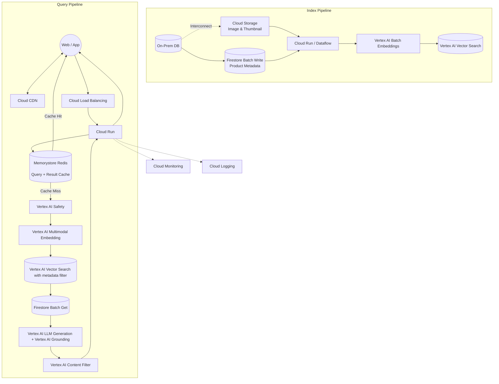
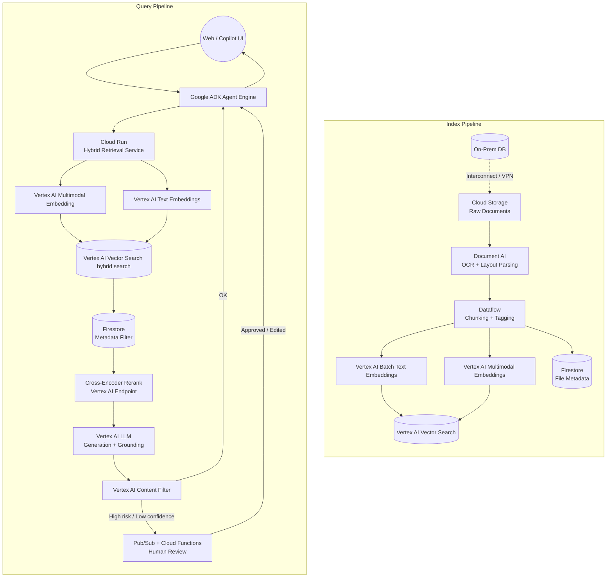
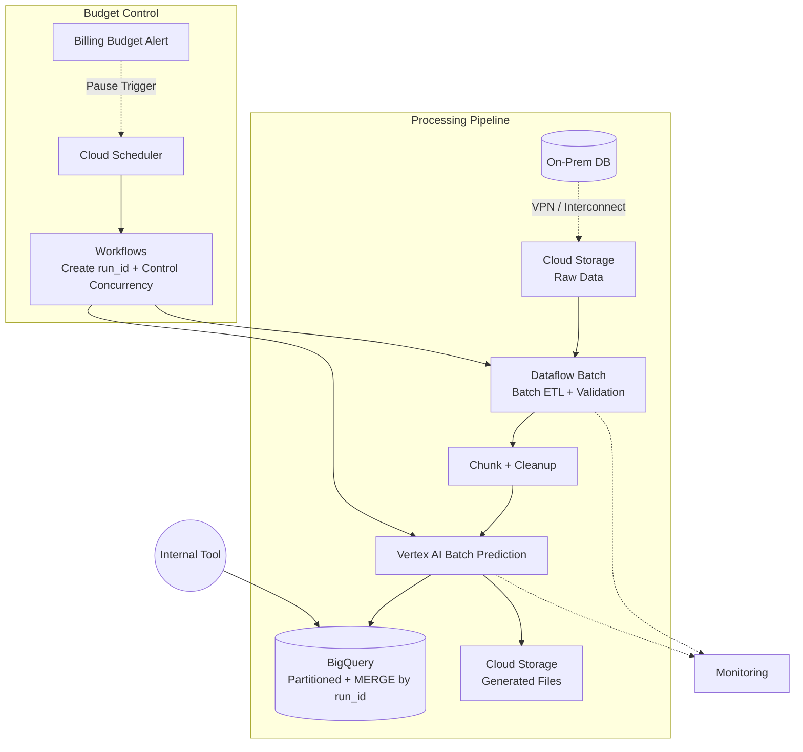

# Enterprise RAG Architecture Template (GCP)

## 1. Speed-First Pattern

Use Cases: Customer-Facing Chatbot, Vision-Based Product Search

### 🎯 Core Objectives

- 🚀 Speed must be fast (low latency first)
- 💰 Cost must be low (optimize batch + cache)
- 🛡 Must include Guardrail & Answer Verification

---

## 2. Accuracy-First Pattern

Use Cases: AI Document Assistant, Co-Pilot (Complex Documents)

### 🎯 Core Objectives

- 🎯 Accuracy first with traceable answers and minimal legal risk
- 📚 Handle complex documents, multiple data source and long context reliably
- 🛡 Strong guardrails, citations, human review, and interpretability

## 3. Cost-First Pattern

Use Cases: Offline Report Generation, Document Processing Automation

### 🎯 Core Objectives

- 💸 Predictable monthly spend and enforce budget caps
- ⏱ Latency-insensitive execution (minutes to hours is acceptable)
- 🚀 Maximize throughput (batch efficiency, parallelism, and pipeline utilization)
- 🧾 Stable, repeatable outputs for reporting, audits, and operations

## 4. Compliance-First Pattern

Use Cases: Healthcare AI Document Assistant

### 🎯 Core Objectives

- 🔒 Data stays in-domain (region / tenant / environment) with strict residency controls
- 🧩 Least privilege access with full auditability (who accessed what, - when, why)
- 🏢 Strong multi-tenant isolation and fine-grained enforcement

TBD